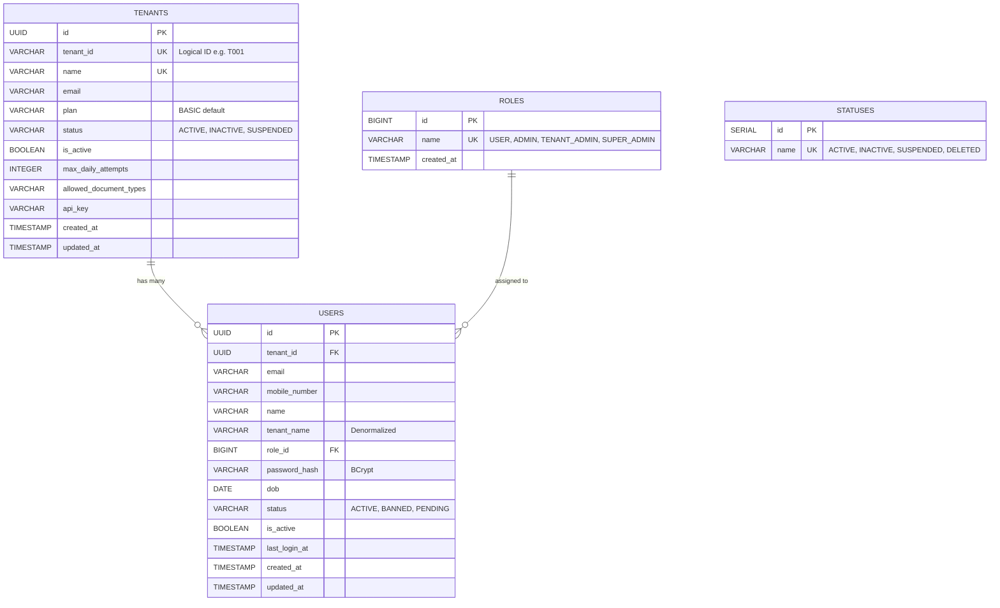
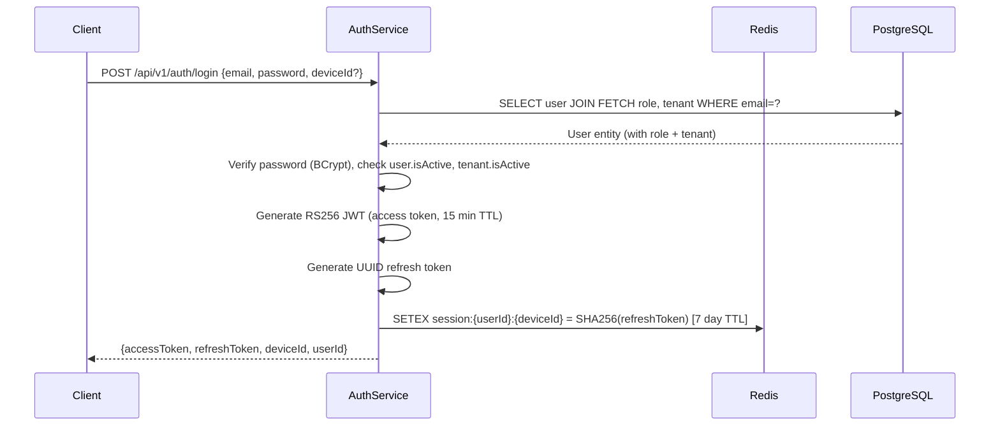

# Auth Service — Project Context

> **Purpose:** This document is the single source of truth for the Auth Service project. Give this file to any AI assistant or collaborator so they can understand the full architecture, codebase, conventions, and current status without needing to re-explore the repository.

---

## 1. Project Overview

The **Auth Service** is a **Centralized Stateless Identity Provider** built to serve an entire microservices ecosystem. It is the **only** service that owns user identities, organizations (tenants), and credentials. All downstream services (KYC, Wallet, Order Management, Voucher) authenticate users purely via **RS256-signed JWTs** issued by this service.

### Ecosystem Services (Downstream Consumers)

| Service | Purpose |
|---|---|
| **KYC System** | Document verification & identity management |
| **Wallet Service** | Financial wallet & transaction management |
| **Order Management** | Customer order processing |
| **Voucher Service** | Voucher/coupon management & redemption |

---

## 2. Tech Stack

| Layer | Technology | Version |
|---|---|---|
| Language | Java | 17 |
| Framework | Spring Boot | 3.4.2 |
| Security | Spring Security | (managed by Boot) |
| Database | PostgreSQL | (latest) |
| ORM | Spring Data JPA / Hibernate | (managed by Boot) |
| Caching / Sessions | Redis | (latest) |
| JWT Library | jjwt (io.jsonwebtoken) | 0.12.6 |
| API Docs | SpringDoc OpenAPI / Swagger UI | 2.5.0 |
| Build Tool | Maven | (wrapper included) |
| Code Gen | Lombok | (latest) |
| Monitoring | Spring Boot Actuator | (managed by Boot) |
| Testing DB | H2 (in-memory, test scope) | — |

---

## 3. Project Structure

```
Auth Service/
├── pom.xml                          # Maven build (Spring Boot 3.4.2, Java 17)
├── src/
│   ├── main/
│   │   ├── java/com/example/auth_service/
│   │   │   ├── AuthServiceApplication.java        # Entry point
│   │   │   ├── config/
│   │   │   │   ├── SecurityConfig.java            # Spring Security filter chain
│   │   │   │   └── SwaggerConfig.java             # OpenAPI/Swagger configuration
│   │   │   ├── controller/
│   │   │   │   ├── AuthController.java            # REST: register, login, refresh, logout
│   │   │   │   ├── JwksController.java            # GET /.well-known/jwks.json
│   │   │   │   └── GlobalExceptionHandler.java    # @RestControllerAdvice error handling
│   │   │   ├── dto/
│   │   │   │   ├── RegistrationRequest.java       # Fields: tenantIdStr, email, password, firstname, lastname, mobileNumber
│   │   │   │   ├── LoginRequest.java              # Fields: email, password, deviceId (optional)
│   │   │   │   ├── RefreshRequest.java            # Fields: refreshToken, deviceId, userId
│   │   │   │   ├── LogoutRequest.java             # Fields: accessTokenJwtId, deviceId, userId
│   │   │   │   └── AuthResponse.java              # Fields: accessToken, refreshToken, deviceId, userId
│   │   │   ├── entity/
│   │   │   │   ├── User.java                      # JPA entity → auth.users
│   │   │   │   ├── Tenant.java                    # JPA entity → auth.tenants
│   │   │   │   └── UserRole.java                  # JPA entity → auth.roles
│   │   │   ├── repository/
│   │   │   │   ├── UserRepository.java            # findByEmail, findByEmailWithRolesAndTenant (JOIN FETCH)
│   │   │   │   ├── TenantRepository.java          # findByTenantIdStr
│   │   │   │   └── RoleRepository.java            # findByName
│   │   │   ├── security/
│   │   │   │   ├── JwtTokenProvider.java          # RS256 JWT generation & validation
│   │   │   │   └── RsaKeyManager.java             # In-memory RSA 2048 key pair generation
│   │   │   └── service/
│   │   │       ├── AuthService.java               # Core business logic
│   │   │       └── TokenStoreService.java         # Redis-backed refresh token & blacklist management
│   │   └── resources/
│   │       ├── application.properties             # Server (8080), PostgreSQL, Redis config
│   │       ├── auth_schema.sql                    # Full DB schema DDL + seed roles
│   │       └── migration/                         # Data migration SQL scripts (01–06)
│   └── test/
│       └── java/com/example/auth_service/
│           ├── AuthServiceApplicationTests.java
│           ├── security/JwtTokenProviderTest.java
│           └── service/TokenStoreServiceTest.java
├── different service data/                        # Reference data exports from peer services
│   ├── Kyc system/
│   ├── order service/
│   ├── voucher service/
│   ├── wallet service/
│   └── exports/
├── ARCHITECTURE.md                                # Centralized Stateless JWT Architecture overview
├── AUTH_FLOW.md                                   # Authentication/Authorization flow deep-dive
├── INTEGRATION_GUIDE.md                           # How downstream services integrate via JWKS
├── MIGRATION_PLAN.md                              # Step-by-step data migration from old services
└── implementation_plan.md                         # Bug fixes & enhancements plan
```

---

## 4. Database Schema

The service uses PostgreSQL with a dedicated `auth` schema:



### Constraints
- `UNIQUE(email, tenant_id)` on `users` — same email can exist in different tenants
- `CASCADE DELETE` on `users.tenant_id → tenants.id`
- Indexes on `users.email` and `users.tenant_id`

### Seeded Roles

| id | name |
|---|---|
| 1 | USER |
| 2 | ADMIN |
| 3 | TENANT_ADMIN |
| 4 | SUPER_ADMIN |

### Role Mapping Across Services

| Auth Role | KYC | Order Mgmt | Wallet | Voucher |
|---|---|---|---|---|
| `USER` | User | CUSTOMER | ROLE_USER | USER |
| `ADMIN` | Default_Admin | ADMIN | ROLE_ORG_ADMIN | — |
| `TENANT_ADMIN` | Tenant_Admin | ORG_ADMIN | — | TENANT_ADMIN |
| `SUPER_ADMIN` | Super_Admin | SUPER_ADMIN | ROLE_SUPER_ADMIN | PLATFORM_ADMIN |

---

## 5. API Endpoints

Base URL: `http://<HOST>:8080`

### Authentication (`/api/v1/auth`)

| Method | Endpoint | Description | Auth Required |
|---|---|---|---|
| `POST` | `/api/v1/auth/register` | Register a new user under a tenant | No |
| `POST` | `/api/v1/auth/login` | Authenticate & get tokens | No |
| `POST` | `/api/v1/auth/refresh` | Refresh access token with a refresh token | No |
| `POST` | `/api/v1/auth/logout` | Invalidate refresh token + blacklist access token | No |

### JWKS (Public Key Distribution)

| Method | Endpoint | Description | Auth Required |
|---|---|---|---|
| `GET` | `/.well-known/jwks.json` | Returns RSA public key in JWKS format (RFC 7517) | No |

### Infrastructure

| Method | Endpoint | Description |
|---|---|---|
| `GET` | `/swagger-ui/index.html` | Swagger UI |
| `GET` | `/v3/api-docs` | OpenAPI JSON spec |
| `GET` | `/actuator/**` | Spring Boot Actuator health/metrics |

---

## 6. Authentication Flow



### Token Refresh Flow
1. Client sends `{refreshToken, deviceId, userId}` to `/api/v1/auth/refresh`
2. Service validates the SHA-256 hash of the refresh token against Redis
3. Old refresh token is **deleted immediately** (one-time use / rotation)
4. New access + refresh tokens are issued

### Logout Flow
1. Client sends `{accessTokenJwtId, deviceId, userId}` to `/api/v1/auth/logout`
2. Service deletes the session from Redis
3. Access token JTI is blacklisted in Redis (15 min TTL)

---

## 7. JWT Token Structure

Tokens are signed with **RS256** (RSA 2048-bit key pair). The key pair is generated **in-memory on startup** (see known issues below).

### JWT Header
```json
{
  "alg": "RS256",
  "typ": "JWT",
  "kid": "<dynamic-key-id>"
}
```

### JWT Payload (Custom Claims)
```json
{
  "sub": "user@example.com",
  "userId": "550e8400-e29b-41d4-a716-446655440000",
  "tenantId": "f47ac10b-58cc-4372-a567-0e02b2c3d479",
  "status": "ACTIVE",
  "tenantStatus": "ACTIVE",
  "roles": ["USER"],
  "jti": "unique-jwt-id",
  "iat": 1711883177,
  "exp": 1711884077
}
```

### How Downstream Services Verify
1. Fetch public key from `GET /.well-known/jwks.json`
2. Verify RS256 signature locally (no network call to Auth Service)
3. Extract `userId`, `tenantId`, `roles`, `status`, `tenantStatus` from claims
4. Enforce both `status == ACTIVE` and `tenantStatus == ACTIVE`

---

## 8. Security Configuration

- **Session Management:** Stateless (`SessionCreationPolicy.STATELESS`)
- **CSRF:** Disabled (stateless JWT-based)
- **CORS:** Disabled at filter level (intended to be managed at API Gateway)
- **Password Encoding:** BCrypt
- **Form Login / HTTP Basic:** Not explicitly disabled (see known issues)
- **Public Endpoints:** `/api/v1/auth/**`, `/.well-known/jwks.json`, Swagger paths, Actuator

---

## 9. Infrastructure Dependencies

| Dependency | Purpose | Default Config |
|---|---|---|
| **PostgreSQL** | Primary data store (users, tenants, roles) | `localhost:5432/auth_db`, schema=`auth` |
| **Redis** | Refresh token sessions + access token blacklist | `localhost:6379` |

---

## 10. Migration Context

This Auth Service was created to centralize identity management from 4 independent monolithic services. The migration follows a **Bridge Pattern**:

1. **Phase 0:** Backup all existing service databases, normalize emails
2. **Phase 1:** Seed Auth Service with merged users, build email→UUID mapping tables
3. **Phase 2:** Add `user_uuid` columns to downstream tables (non-breaking)
4. **Phase 3:** Backfill UUIDs using mapping tables, validate zero NULLs
5. **Phase 3.5:** Dual-write phase (both old ID and new UUID)
6. **Phase 4:** Code cutover — read from UUID, fallback to old ID
7. **Phase 5:** Drop old columns, remove old user tables, remove fallback logic

Reference data from all 4 peer services is stored in `different service data/` for mapping.

Migration SQL scripts in `src/main/resources/migration/`:
- `01_mapping_tables.sql` — Creates user/tenant mapping tables
- `03_load_csv_data.sql` — Loads exported CSV data
- `04_seed_auth_service.sql` — Seeds auth users & tenants
- `05_seed_roles.sql` — Seeds roles + cross-service role mapping
- `06_downstream_backfill.sql` — Backfills UUIDs into downstream DBs

---

## 11. Known Issues & Technical Debt

| # | Issue | Detail |
|---|---|---|
| 1 | **Ephemeral RSA Keys** | Key pair is generated in-memory each startup. Restarting the service invalidates all previously issued JWTs. Should persist keys to disk or a secret manager. |
| 2 | **HTTP Basic not disabled** | `httpBasic()` is not explicitly disabled in `SecurityConfig`, which can cause 401 responses from external IPs due to Spring Security's default challenge. |
| 3 | **No JWT filter on protected endpoints** | There is no `OncePerRequestFilter` that reads and validates the JWT from incoming requests to protected endpoints within this service. Currently only the public endpoints are defined. |
| 4 | **Generic exception handling** | All `RuntimeException`s return `401 UNAUTHORIZED`. Should differentiate between 400 (bad input), 401 (auth failure), 403 (forbidden), 404 (not found), and 409 (conflict). |
| 5 | **No access token blacklist check** | `isAccessTokenBlacklisted()` exists in `TokenStoreService` but is never called in any filter/interceptor. |
| 6 | **Password stored as BCrypt, peer services may differ** | Some downstream services may use different hashing (e.g., SHA-256 with salt). A unified strategy using `DelegatingPasswordEncoder` may be needed. |
| 7 | **`ddl-auto=update` in production** | Hibernate auto-DDL should be set to `validate` or `none` in production. |

---

## 12. How To Run

### Prerequisites
- Java 17+
- PostgreSQL running on `localhost:5432` with database `auth_db` and schema `auth`
- Redis running on `localhost:6379`

### Steps
```bash
# Clone and navigate to project
cd "Auth Service"

# Run database schema setup (first time only)
psql -U root -d auth_db -f src/main/resources/auth_schema.sql

# Start the application
./mvnw spring-boot:run

# Access Swagger UI
open http://localhost:8080/swagger-ui/index.html
```

---

## 13. Key Design Decisions

1. **Email as Anchor Field:** Email is used as the common denominator to map users across all legacy services during migration.
2. **Flat Role Model:** Each user has a single role (via `role_id` FK) rather than a many-to-many relationship. This simplifies the model for the current 4-role system.
3. **Device-based Sessions:** Refresh tokens are scoped per `(userId, deviceId)`, enabling per-device logout and session management.
4. **One-time Refresh Tokens (Rotation):** Each refresh token can only be used once. On use, it's deleted and a new one is issued. Token reuse is detected and causes session invalidation (replay attack protection).
5. **SHA-256 Hashed Refresh Tokens:** Refresh tokens are stored as SHA-256 hashes in Redis, so even if Redis is compromised, raw tokens cannot be recovered.
6. **JWKS Endpoint for Trust:** Public key distribution via `/.well-known/jwks.json` follows the industry-standard JWKS protocol, allowing downstream services to verify tokens without sharing secrets.

---

## 14. Conventions & Patterns

- **Package Structure:** Standard layered — `controller` → `service` → `repository` → `entity`
- **Validation:** Jakarta Bean Validation (`@NotBlank`, `@Email`) on DTOs
- **Error Handling:** Centralized via `@RestControllerAdvice` in `GlobalExceptionHandler`
- **UUID Primary Keys:** All core entities (`User`, `Tenant`) use `UUID` PKs for global uniqueness
- **Lombok:** Used throughout for `@Data`, `@Builder`, `@Getter`, `@Setter`, etc.
- **Schema:** All tables live under the `auth` PostgreSQL schema
- **API Versioning:** URL path based (`/api/v1/auth/...`)

---

## 15. Existing Documentation

| File | Content |
|---|---|
| `ARCHITECTURE.md` | High-level stateless JWT architecture, entity specs, migration strategy overview |
| `AUTH_FLOW.md` | Detailed authentication vs authorization mechanics, RS256 trust model, implementation phases |
| `INTEGRATION_GUIDE.md` | Step-by-step guide for downstream services to integrate (JWKS, Spring Boot config, claim extraction) |
| `MIGRATION_PLAN.md` | Detailed SQL-level data migration plan with all phases, validation queries, and rollback strategy |
| `implementation_plan.md` | Active bug fixes: Swagger 401, external IP 401, ROLE_TENANT_ADMIN addition, tenantStatus in JWT |
